# 电影世界项目架构设计文档

## 目录
- [系统架构图](#系统架构图)
- [技术架构图](#技术架构图)
- [数据库设计](#数据库设计)
- [业务流程图](#业务流程图)
- [模块关系图](#模块关系图)

---

## 系统架构图

### 整体架构（三层架构）

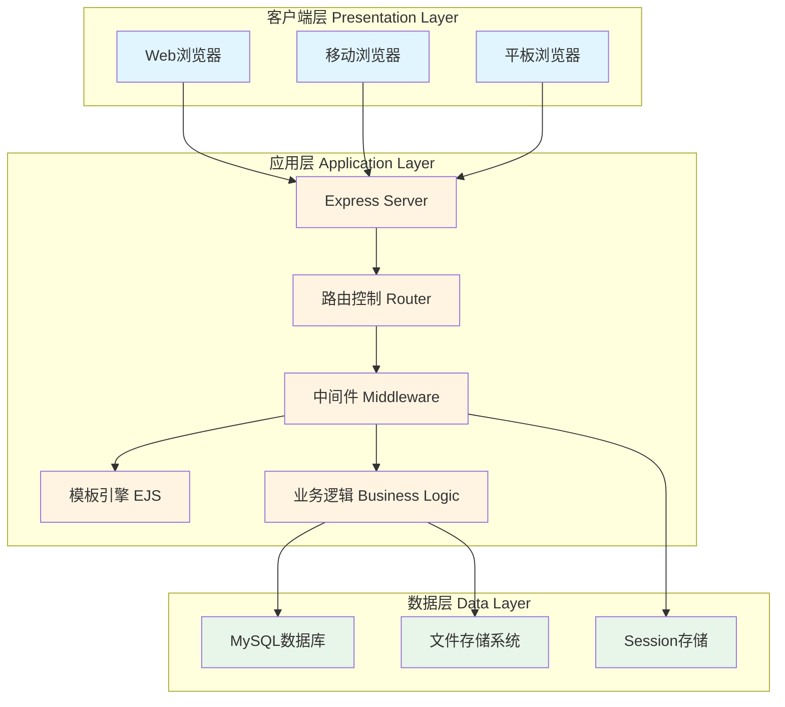

### MVC架构模式

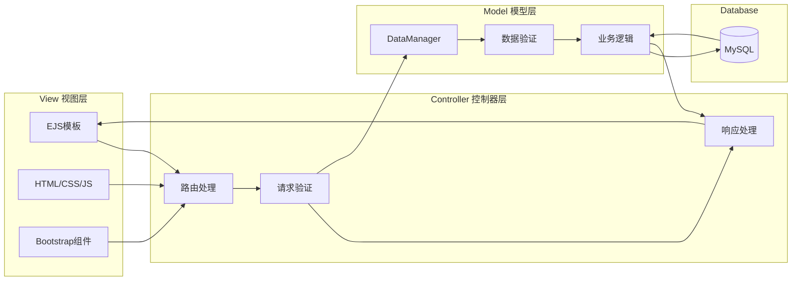

---

## 技术架构图

### 前后端交互流程

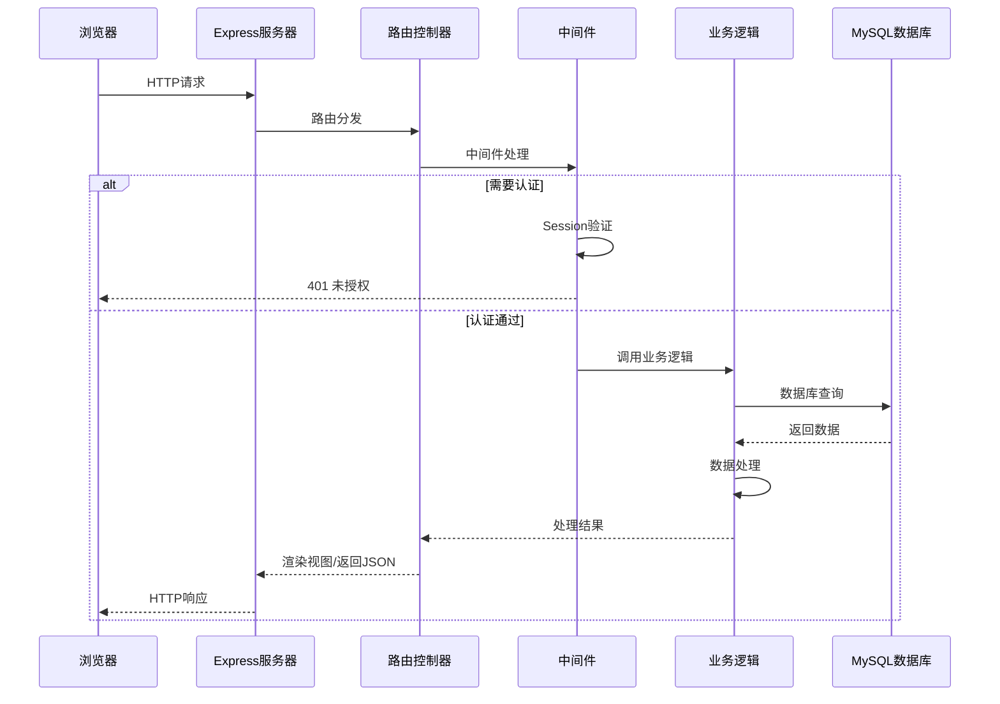

### 技术栈层次图

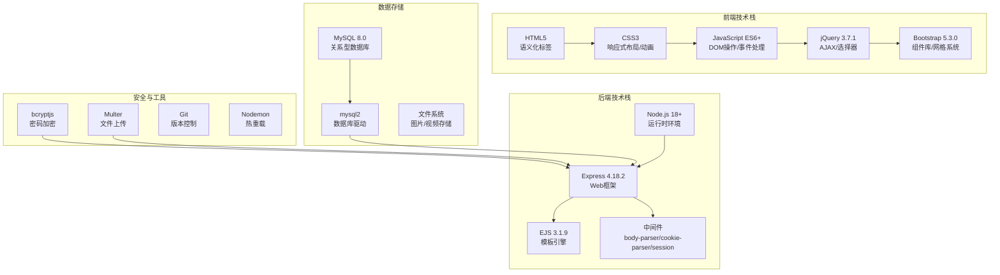

---

## 数据库设计

### ER图（实体关系图）

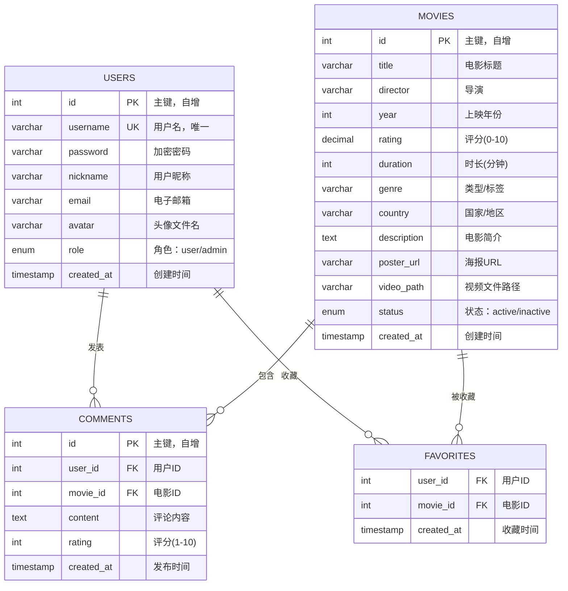

### 数据表关系图

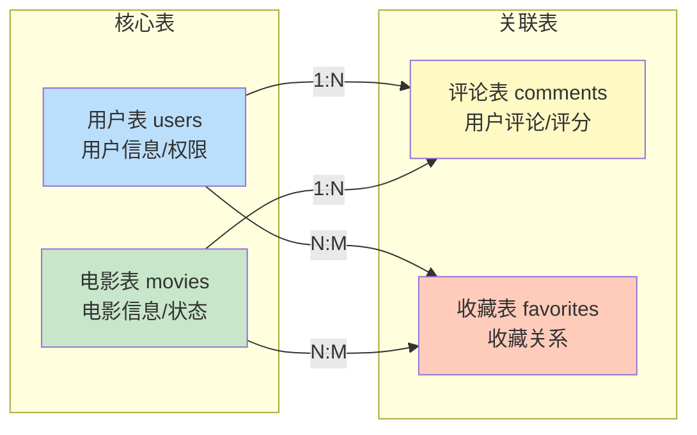

### 详细表结构

#### 用户表 (users)

| 字段名 | 类型 | 长度 | 约束 | 说明 |
|--------|------|------|------|------|
| id | INT | - | PRIMARY KEY, AUTO_INCREMENT | 用户ID |
| username | VARCHAR | 50 | UNIQUE, NOT NULL | 登录账号 |
| password | VARCHAR | 255 | NOT NULL | 加密密码(bcrypt) |
| nickname | VARCHAR | 50 | NOT NULL | 用户昵称 |
| email | VARCHAR | 100 | NOT NULL | 电子邮箱 |
| avatar | VARCHAR | 255 | NULL | 头像文件名 |
| role | ENUM | - | DEFAULT 'user' | 用户角色(user/admin) |
| created_at | TIMESTAMP | - | DEFAULT CURRENT_TIMESTAMP | 注册时间 |

**索引设计：**
- PRIMARY KEY (id)
- UNIQUE KEY (username)
- INDEX (email)

#### 电影表 (movies)

| 字段名 | 类型 | 长度 | 约束 | 说明 |
|--------|------|------|------|------|
| id | INT | - | PRIMARY KEY, AUTO_INCREMENT | 电影ID |
| title | VARCHAR | 200 | NOT NULL | 电影标题 |
| director | VARCHAR | 100 | NULL | 导演 |
| year | INT | - | NULL | 上映年份 |
| rating | DECIMAL | (3,1) | NULL | 评分(0.0-10.0) |
| duration | INT | - | NULL | 时长(分钟) |
| genre | VARCHAR | 100 | NULL | 类型(动作,剧情等) |
| country | VARCHAR | 100 | NULL | 国家/地区 |
| description | TEXT | - | NULL | 电影简介 |
| poster_url | VARCHAR | 500 | NULL | 海报URL |
| video_path | VARCHAR | 255 | NULL | 视频文件路径 |
| status | ENUM | - | DEFAULT 'active' | 状态(active/inactive) |
| created_at | TIMESTAMP | - | DEFAULT CURRENT_TIMESTAMP | 创建时间 |

**索引设计：**
- PRIMARY KEY (id)
- INDEX (title)
- INDEX (genre)
- INDEX (year)
- INDEX (status)

#### 评论表 (comments)

| 字段名 | 类型 | 长度 | 约束 | 说明 |
|--------|------|------|------|------|
| id | INT | - | PRIMARY KEY, AUTO_INCREMENT | 评论ID |
| user_id | INT | - | FOREIGN KEY, NOT NULL | 用户ID |
| movie_id | INT | - | FOREIGN KEY, NOT NULL | 电影ID |
| content | TEXT | - | NOT NULL | 评论内容 |
| rating | INT | - | NULL | 评分(1-10) |
| created_at | TIMESTAMP | - | DEFAULT CURRENT_TIMESTAMP | 发布时间 |

**索引设计：**
- PRIMARY KEY (id)
- FOREIGN KEY (user_id) REFERENCES users(id) ON DELETE CASCADE
- FOREIGN KEY (movie_id) REFERENCES movies(id) ON DELETE CASCADE
- INDEX (movie_id, created_at)

#### 收藏表 (favorites)

| 字段名 | 类型 | 长度 | 约束 | 说明 |
|--------|------|------|------|------|
| user_id | INT | - | FOREIGN KEY, NOT NULL | 用户ID |
| movie_id | INT | - | FOREIGN KEY, NOT NULL | 电影ID |
| created_at | TIMESTAMP | - | DEFAULT CURRENT_TIMESTAMP | 收藏时间 |

**索引设计：**
- PRIMARY KEY (user_id, movie_id)
- FOREIGN KEY (user_id) REFERENCES users(id) ON DELETE CASCADE
- FOREIGN KEY (movie_id) REFERENCES movies(id) ON DELETE CASCADE
- INDEX (user_id)
- INDEX (movie_id)

---

## 业务流程图

### 用户注册流程

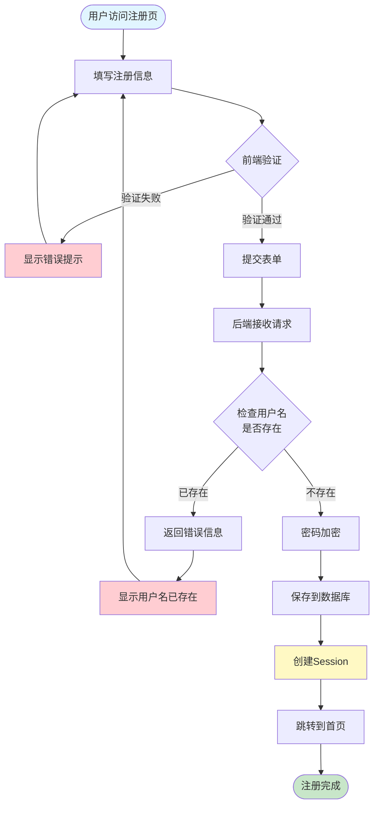

### 用户登录流程

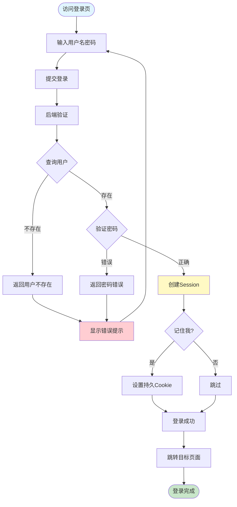

### 电影收藏流程

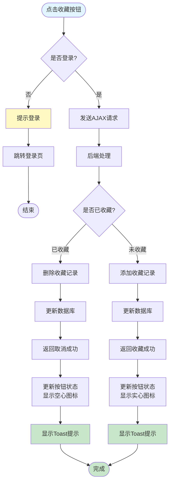

### 电影评论流程

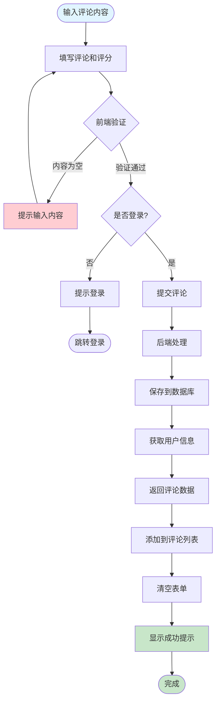

### 管理员添加电影流程

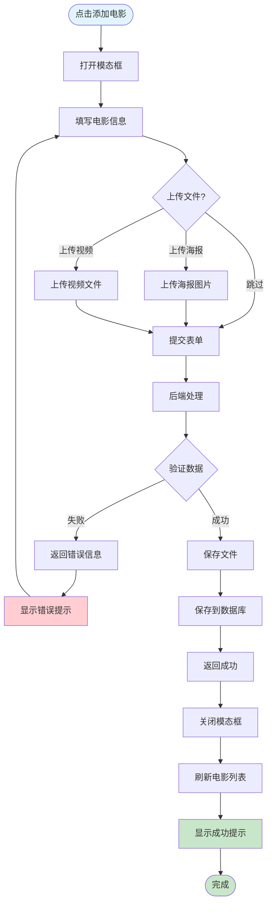

---

## 模块关系图

### 路由模块关系

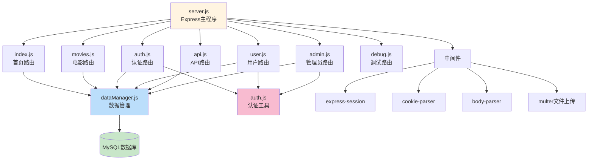

### 视图模板关系

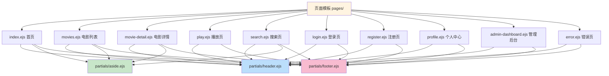

### 文件存储结构

```mermaid
graph TD
    Public[public/ 静态资源] --> CSS[css/]
    Public --> JS[js/]
    Public --> Images[images/]
    Public --> Uploads[uploads/]
    Public --> Video[vedio/]
    
    CSS --> StyleCSS[style.css 自定义样式]
    JS --> MainJS[main.js 自定义脚本]
    
    Images --> MoviePosters[电影海报 1.jpg~13.jpg]
    Images --> DefaultImages[默认图片]
    
    Uploads --> Avatars[avatars/ 用户头像]
    Uploads --> Posters[posters/ 电影海报]
    
    Video --> VideoFiles[视频文件 *.mp4]
    
    Avatars --> AvatarFiles[avatar-{userId}-{timestamp}.jpg]
    Posters --> PosterFiles[poster-{movieId}-{timestamp}.jpg]
    VideoFiles --> MovieVideos[{movieId}.mp4/webm/ogg]
    
    style Public fill:#fff4e1
    style CSS fill:#e1f5ff
    style JS fill:#fff9c4
    style Images fill:#c8e6c9
    style Uploads fill:#ffccbc
    style Video fill:#f8bbd0
```

---

## 数据流图

### 用户请求数据流

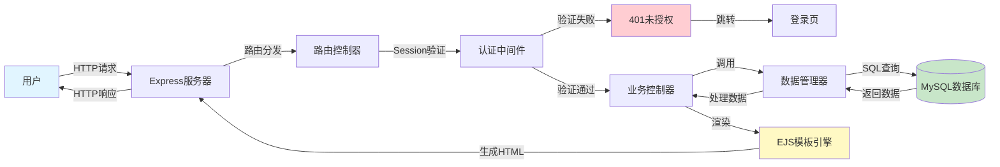

### AJAX异步数据流

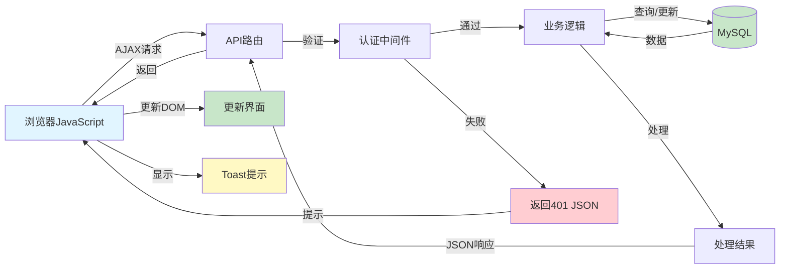

---

## 安全架构

### 安全防护体系

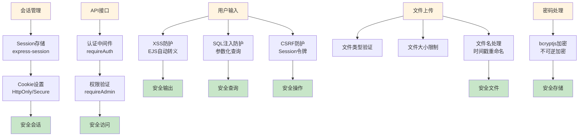

---

## 部署架构

### 生产环境部署架构

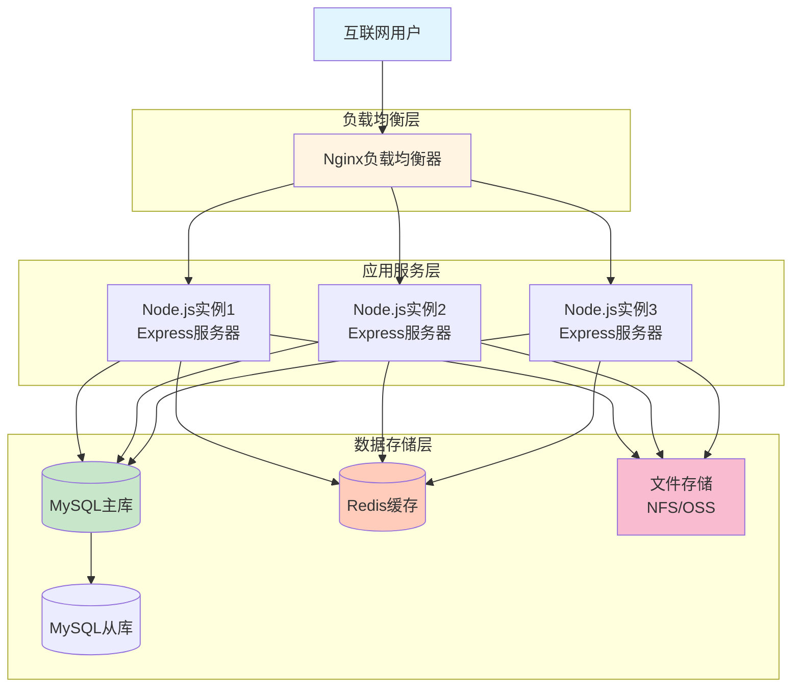

---

## 总结

本文档详细描述了电影世界项目的各个架构层面：

1. **系统架构** - 三层架构和MVC模式
2. **技术架构** - 前后端技术栈和交互流程
3. **数据库设计** - ER图和详细表结构
4. **业务流程** - 核心业务的流程图
5. **模块关系** - 代码模块的组织关系
6. **数据流** - 请求响应的数据流转
7. **安全架构** - 完整的安全防护体系
8. **部署架构** - 生产环境部署方案

这些图表清晰地展示了项目的整体设计思路和技术实现细节，为项目的开发、维护和扩展提供了完整的参考。
