# 电影世界项目架构设计文档

## 目录
- [系统架构图](#系统架构图)
- [技术架构图](#技术架构图)
- [数据库设计](#数据库设计)
- [业务流程图](#业务流程图)
- [模块关系图](#模块关系图)

---

## 系统架构图

### 整体架构（三层架构）

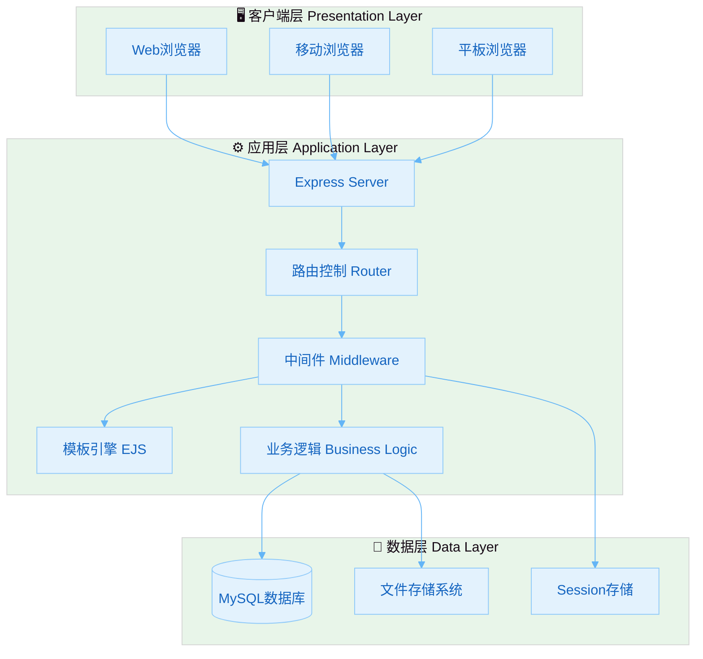

### MVC架构模式

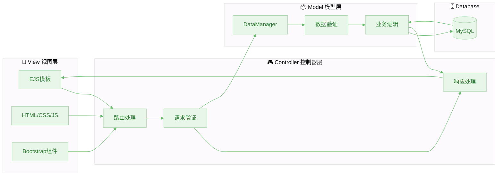

---

## 技术架构图

### 前后端交互流程

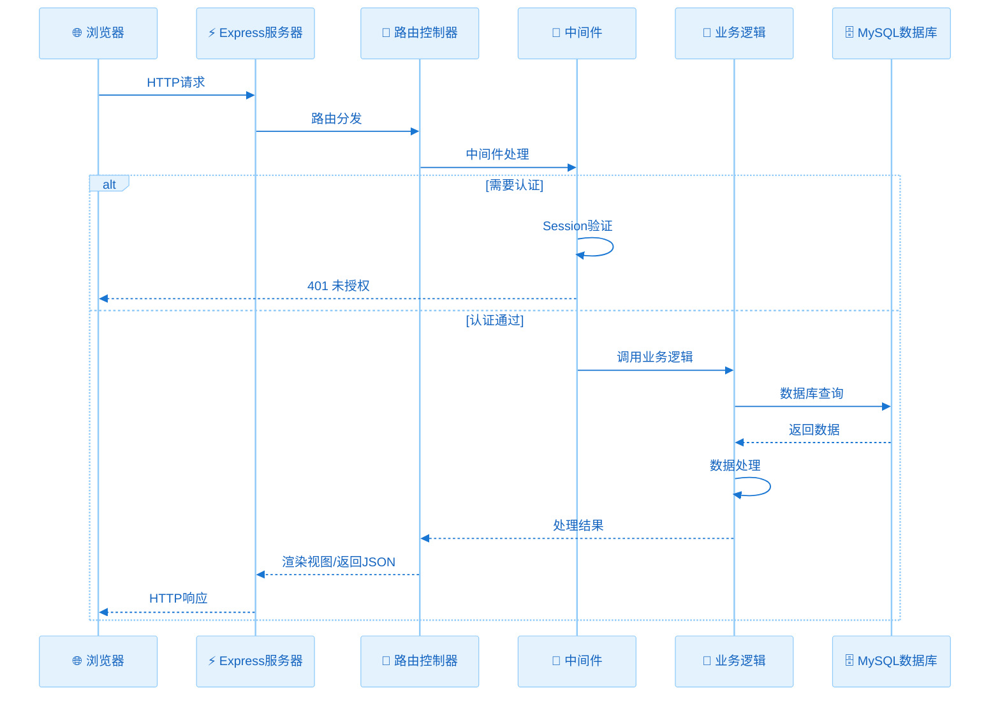

### 技术栈层次图

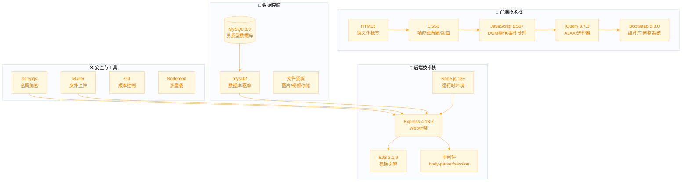

---

## 数据库设计

### ER图（实体关系图）

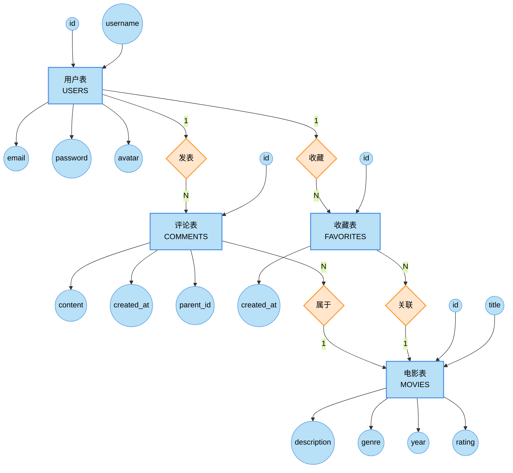

### 数据表关系图

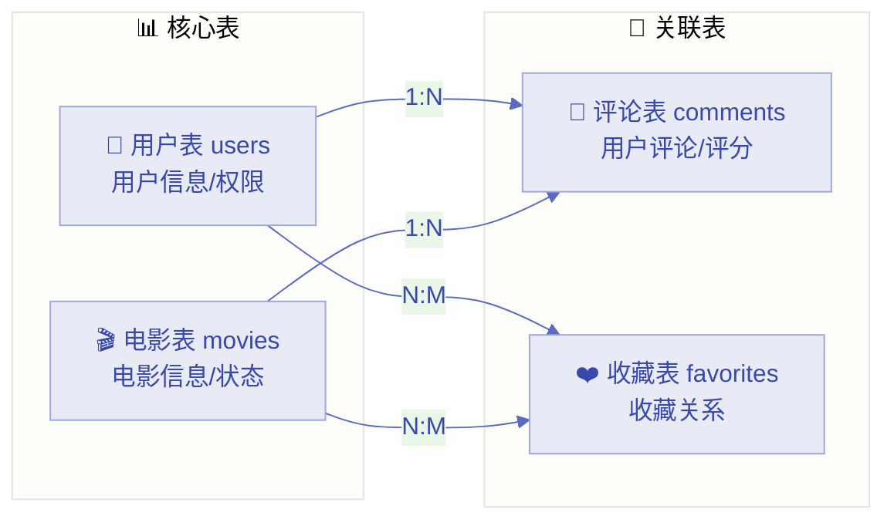

---

## 详细表结构

### 用户表 (users)

| 字段名 | 类型 | 长度 | 约束 | 说明 |
|--------|------|------|------|------|
| id | INT | - | PRIMARY KEY, AUTO_INCREMENT | 用户ID |
| username | VARCHAR | 50 | UNIQUE, NOT NULL | 登录账号 |
| nickname | VARCHAR | 50 | NULL | 用户昵称 |
| avatar | VARCHAR | 255 | NULL | 头像文件名 |
| email | VARCHAR | 100 | UNIQUE, NOT NULL | 电子邮箱 |
| password | VARCHAR | 255 | NOT NULL | 加密密码(bcrypt) |
| role | ENUM | - | DEFAULT 'user' | 用户角色(user/admin) |
| created_at | TIMESTAMP | - | DEFAULT CURRENT_TIMESTAMP | 注册时间 |
| updated_at | TIMESTAMP | - | DEFAULT CURRENT_TIMESTAMP ON UPDATE | 更新时间 |

### 电影表 (movies)

| 字段名 | 类型 | 长度 | 约束 | 说明 |
|--------|------|------|------|------|
| id | INT | - | PRIMARY KEY, AUTO_INCREMENT | 电影ID |
| title | VARCHAR | 100 | NOT NULL | 电影标题 |
| description | TEXT | - | NULL | 电影简介 |
| genre | VARCHAR | 50 | NULL | 类型 |
| year | INT | - | NULL | 上映年份 |
| rating | DECIMAL | (3,1) | NULL | 评分(0.0-10.0) |
| poster_url | VARCHAR | 255 | NULL | 海报URL |
| director | VARCHAR | 100 | NULL | 导演 |
| duration | INT | - | NULL | 时长(分钟) |
| country | VARCHAR | 100 | NULL | 国家/地区 |
| status | ENUM | - | DEFAULT 'active' | 状态(active/inactive) |
| created_at | TIMESTAMP | - | DEFAULT CURRENT_TIMESTAMP | 创建时间 |

### 评论表 (comments)

| 字段名 | 类型 | 约束 | 说明 |
|--------|------|------|------|
| id | INT | PRIMARY KEY, AUTO_INCREMENT | 评论ID |
| user_id | INT | FOREIGN KEY → users(id) ON DELETE CASCADE | 用户ID |
| movie_id | INT | FOREIGN KEY → movies(id) ON DELETE CASCADE | 电影ID |
| parent_id | INT | FOREIGN KEY → comments(id) ON DELETE CASCADE, NULL | 父评论ID(支持回复) |
| content | TEXT | NOT NULL | 评论内容 |
| created_at | TIMESTAMP | DEFAULT CURRENT_TIMESTAMP | 发布时间 |
| updated_at | TIMESTAMP | DEFAULT CURRENT_TIMESTAMP ON UPDATE | 更新时间 |

### 收藏表 (favorites)

| 字段名 | 类型 | 约束 | 说明 |
|--------|------|------|------|
| id | INT | PRIMARY KEY, AUTO_INCREMENT | 收藏ID |
| user_id | INT | FOREIGN KEY → users(id) ON DELETE CASCADE | 用户ID |
| movie_id | INT | FOREIGN KEY → movies(id) ON DELETE CASCADE | 电影ID |
| created_at | TIMESTAMP | DEFAULT CURRENT_TIMESTAMP | 收藏时间 |

> 注：user_id + movie_id 组合唯一索引，确保同一用户不能重复收藏同一电影

---

## 业务流程图

### 用户注册流程

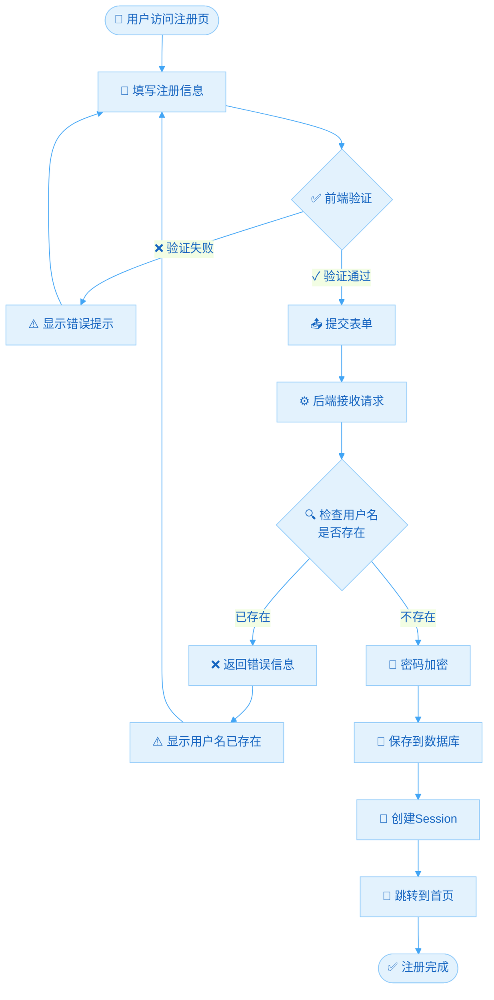

### 用户登录流程

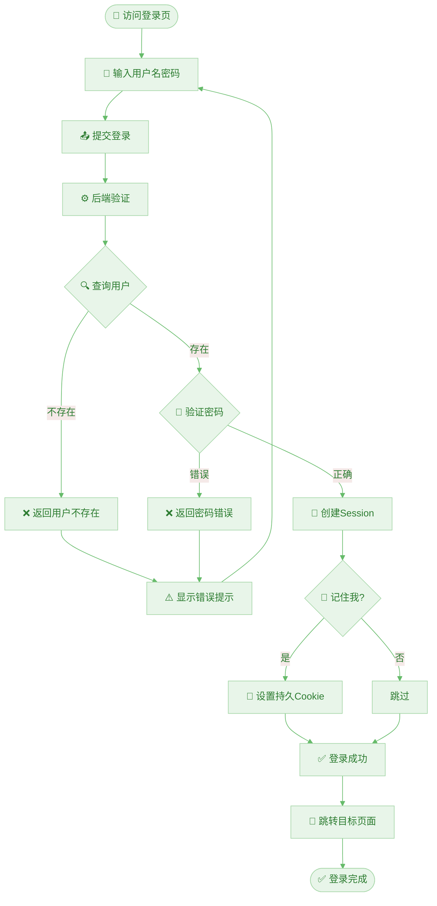

### 电影收藏流程

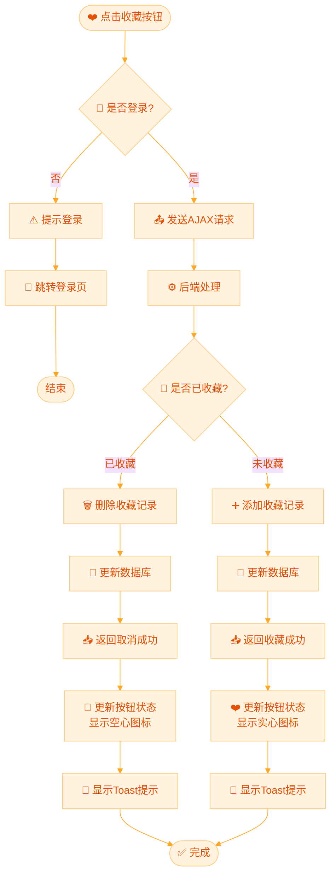

### 评论发表流程

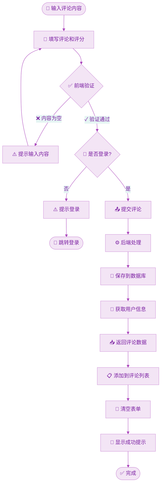

### 管理员添加电影流程

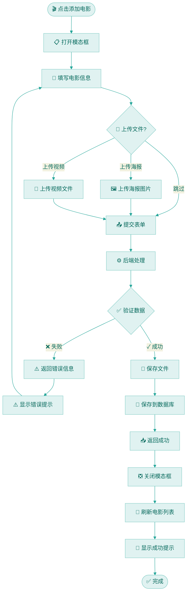

---

## 模块关系图

### 路由模块关系

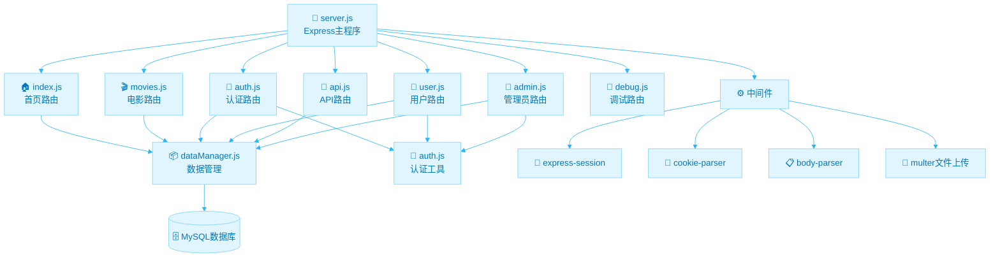

### 视图模板关系

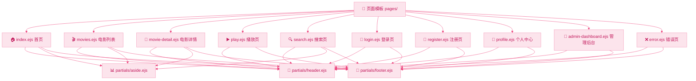

### 文件存储结构

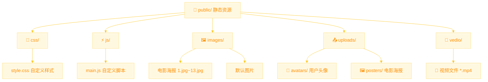

---

## 数据流图

### 用户请求数据流

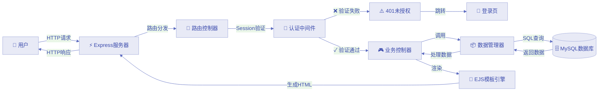

### AJAX异步数据流

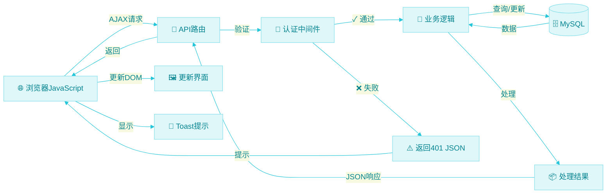

---

## 安全架构

### 安全防护体系

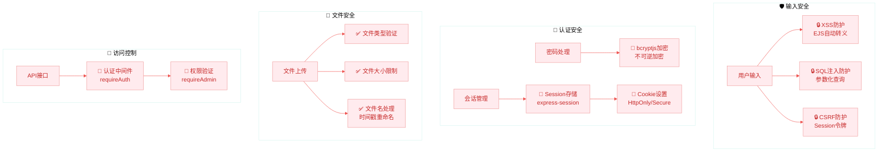

---

## 部署架构

### 生产环境部署架构

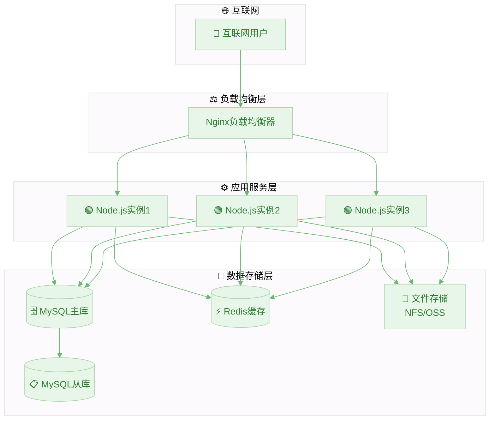

---

## 总结

本文档详细描述了电影世界项目的各个架构层面：

| 章节 | 描述 |
|------|------|
| 📊 系统架构 | 三层架构和MVC模式 |
| 🔧 技术架构 | 前后端技术栈和交互流程 |
| 🗄️ 数据库设计 | ER图和详细表结构 |
| 🔄 业务流程 | 核心业务的流程图 |
| 📦 模块关系 | 代码模块的组织关系 |
| 🔀 数据流 | 请求响应的数据流转 |
| 🔐 安全架构 | 完整的安全防护体系 |
| 🚀 部署架构 | 生产环境部署方案 |

这些图表清晰地展示了项目的整体设计思路和技术实现细节，为项目的开发、维护和扩展提供了完整的参考。
